# UX Audit, Mortang Meals: Plan the week and shop

## Executive Summary

A returning cook can get from an empty week to a filled grid and a shopping list, and the visual language (olive, linen, day-column planner) is calm and consistent. The journey still trips on the two jobs that matter: **placing meals** and **leaving with a list you can shop**. Fill is aimed at four dinners that are already on the board, while fourteen breakfast and lunch cells shout Add + Takeout. The shopping list then repeats garlic three times and olive oil four, with no way to check items off. On the phone, fill options wrap so the protein cap sits beside Leftover lunches, and the nav including Developer eats two rows. Top three fixes: merge the list and add check-off; stop painting empty cells the fill mask will not fill; one week control, without a trash can on every chip.

## Scope & Method

- **Goal evaluated:** A returning cook plans this calendar week from the saved library (fill, place, leftovers, takeout) and builds a shopping list from that plan
- **User type / platform:** Returning · desktop web and mobile web
- **Screens:**

| Step | File | Screen |
|------|------|--------|
| 1 | `01-desktop-plans.png` | Plans — this week (mostly empty) |
| 2 | `02-desktop-plans-filled.png` | Plans — older filled week |
| 3 | `03-desktop-recipe-flyout.png` | Recipe flyout |
| 4 | `04-desktop-add-side.png` | Attached side recipe |
| 5 | `05-desktop-meals.png` | Meals — generate, drafts, catalog |
| 6 | `06-desktop-shopping.png` | Shopping list — this week |
| 7 | `07-desktop-shopping-filled.png` | Shopping list — filled week |
| 8 | `08-desktop-household.png` | Household |
| 9 | `09-desktop-kitchen.png` | Kitchen |
| 10 | `10-mobile-plans.png` | Plans (phone, first screen) |
| 11 | `11-mobile-meals.png` | Meals (phone, first screen) |
| 12 | `12-mobile-shopping.png` | Shopping list (phone, produce) |

Mobile assets in this folder are cropped to about two viewports so markers stay readable. Full-page captures live in `ux-audit-screenshots/assets/`.

- **Frameworks applied:** Nielsen, Shneiderman, Gerhardt-Powals, Bastien & Scapin, behavioural laws, Fogg, Cialdini, Gestalt, Norman, Tognazzini, WCAG 2.1 (static subset), Content heuristics
- **Not assessable from static screens:** focus order, keyboard and screen-reader semantics, whether flyouts close on overlay click, whether week trash asks for confirmation, generate/fill latency, motion, whether star glyphs are a control or a display. The Next.js `N` badge is a local-dev overlay and is ignored.

## Findings Overview

| ID | Sev | Screen | Check | Finding | Heuristics |
|----|-----|--------|-------|---------|------------|
| F-01 | 3 | 6, 7, 12 | OVERLOAD | Same ingredient listed multiple times instead of merged | G-P #7 · Nielsen #8 · Peak-End Rule |
| F-02 | 3 | 6, 12 | STATE-GAP | Shopping list has no check-off, packed, or done state | Jakob's Law · Nielsen #1 · Shneiderman #3 |
| F-03 | 3 | 1, 10 | CTA-AMBIGUITY | Fill targets 4 dinners already placed; 14 empty cells still shout Add + Takeout | Hick's Law · Nielsen #1/#8 · Fogg Ability |
| F-04 | 3 | 10 | TOUCH-TARGET | Phone fill controls wrap; protein `2` sits next to Leftover lunches; pin/trash are icon-only | Gestalt: Proximity · Fitts's Law · WCAG 2.5.5 |
| F-05 | 2 | 1, 2, 10 | PATTERN-DRIFT | Week identity is shown three ways; Previous/Next labels the open week | Nielsen #2 · Norman: Mapping · G-P #8 |
| F-06 | 2 | 5, 11 | OVERLOAD | Meals stacks generate, drafts, import, search, and the full catalog | Hick's Law · G-P #8 · B&S: Workload |
| F-07 | 2 | 1, 6, 10, 12 | — | Trash sits on every week chip, including on the shopping list | Nielsen #5 · Fitts's Law |
| F-08 | 2 | 1 | — | Dinner titles clip to stubs that do not name the dish | Nielsen #6 · Content #1 |
| F-09 | 2 | 8, 9 | JARGON-LEAK | Household and Kitchen still talk about generating a week | Content #5 · Nielsen #2 |
| F-11 | 2 | 3, 4 | — | Recipe panel has no visible close control | Nielsen #3 · Tog: Explorable |
| F-10 | 1 | 1, 10–12 | JARGON-LEAK | Developer is in the primary nav | Nielsen #8 · Content #9 |

## Screen-by-Screen

### Step 1: Plans, this week (`01-desktop-plans.png`)

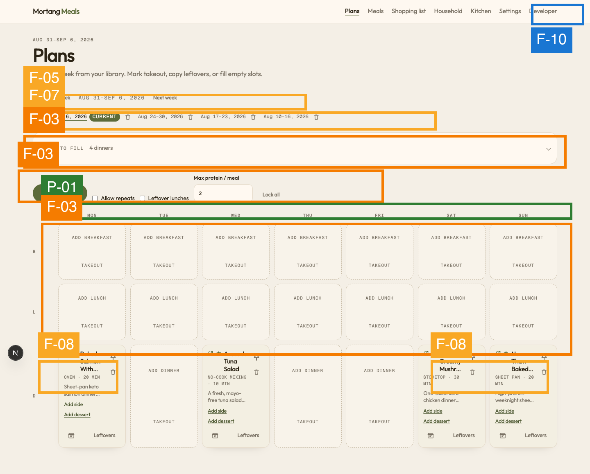

#### [S3] F-03 · Fill is aimed at dinners that are already filled
- **Check:** CTA-AMBIGUITY · **Heuristics:** Hick's Law, Nielsen #1 (visibility of status), Nielsen #8 (minimalist design), Fogg Ability
- **Evidence:** The accordion reads **SLOTS TO FILL 4 dinners**. Those four dinner cards are already placed (Mon, Wed, Sat, Sun). Breakfast and lunch are fourteen dashed cells, each with **ADD BREAKFAST** / **ADD LUNCH** and **TAKEOUT** at equal weight. The only filled primary button is **Fill empty slots**, sitting beside Allow repeats, Leftover lunches, Max protein / meal, and Lock all.
- **Impact on goal:** The cook who wants this week planned is looking at a wall of empty cells the primary action will not fill (they are not in the mask). Clicking Fill looks like a no-op. Planning breakfast or lunch means hunting among 28 identical ghost actions.
- **Recommendation:** Derive the fill mask from empty cells the user can see, or collapse unselected meal rows. Give Add visual priority over Takeout. Hide or disable Fill when the mask is already satisfied, and explain why. Spell out Lock all. · **Effort:** M

#### [S2] F-05 · Three competing week labels
- **Check:** PATTERN-DRIFT · **Heuristics:** Nielsen #2 (match the real world), Norman: Mapping, G-P #8 (only needed info)
- **Evidence:** The kicker is `AUG 31–SEP 6, 2026`. Between **Previous week** and **Next week** the same range is repeated, so it reads as if Previous week *is* Aug 31–Sep 6. A third row of chips repeats every week, with **CURRENT** on this one.
- **Impact on goal:** Opening the wrong week means filling or shopping the wrong list. Returning users should not have to decode which of three date widgets is the source of truth.
- **Recommendation:** Keep the heading date plus one control: either prev/next *or* a compact chip row, not both. Do not put the open week's date between the words Previous week and Next week. · **Effort:** S

#### [S2] F-07 · Week chips carry trash
- **Check:** (error prevention) · **Heuristics:** Nielsen #5, Fitts's Law
- **Evidence:** Each week chip has a trash icon immediately after the date, including the **CURRENT** week.
- **Impact on goal:** Navigation and deletion share a target. An accidental hit while switching weeks can drop the plan the shopping list is built from. (Confirmation is not visible in the screenshot; do not assume it exists.)
- **Recommendation:** Move delete into an overflow on the open plan, not onto every chip. Never place it on the shopping-list week switcher. · **Effort:** S

#### [S2] F-08 · Dinner names clip to stubs
- **Check:** (recognition) · **Heuristics:** Nielsen #6, Content #1 (front-load)
- **Evidence:** Desktop cards show **Baked Salmon With…**, **Keto Creamy Mushr…**, **No-Thaw Baked…**. Method and minutes are fully visible; the dish name is not.
- **Impact on goal:** Choosing or confirming this week's dinners is a recognition task. Truncated titles force the cook to open the flyout to tell salmon from “mushr”.
- **Recommendation:** Allow two title lines, or shrink method/why before clipping the name. Front-load the distinctive words (Salmon, Cod, Tuna). · **Effort:** S

#### [S1] F-10 · Developer in the primary nav
- **Check:** JARGON-LEAK · **Heuristics:** Nielsen #8, Content #9
- **Evidence:** **Developer** sits after Settings in the global nav on every screen captured (developer tools are on).
- **Impact on goal:** Extra choice in the main bar, worse on mobile where the nav wraps (F-04). Not on the plan-and-shop path.
- **Recommendation:** Keep Developer out of the cook-facing bar; a Settings toggle is enough. · **Effort:** S

#### [✓] P-01 · Day columns and B / L / D rows
- **Heuristics:** Norman: Mapping, Gestalt: Common region
- **Evidence:** MON–SUN across the top, B / L / D on the left. This is a paper weekly planner. Keep it.

### Step 2: Plans, older filled week (`02-desktop-plans-filled.png`)

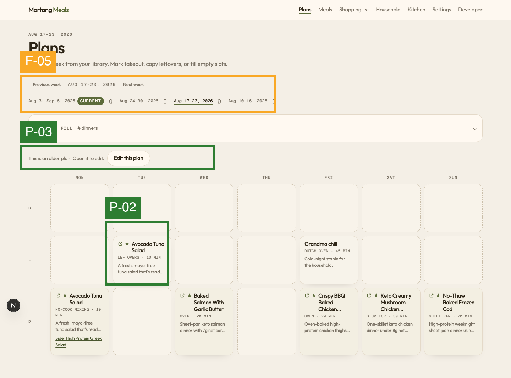

#### [S2] F-05 · Same week-switcher collision (occurrence)
- **Evidence:** Viewing Aug 17–23. **Previous week** sits next to `AUG 17–23, 2026`. **CURRENT** remains on Aug 31–Sep 6. The cook has to reconcile “this screen’s date”, “previous week”, and “current”.

#### [✓] P-03 · Older plans are explicitly locked
- **Heuristics:** Nielsen #1, Nielsen #5
- **Evidence:** **This is an older plan. Open it to edit.** plus **Edit this plan**. Fill controls are gone. Status and a path back to editing are both visible. Keep this pattern.

#### [✓] P-02 · Cards encode leftover, time, and method
- **Heuristics:** G-P #9 (multiple coding), Nielsen #6
- **Evidence:** Tuesday lunch shows **LEFTOVERS · 10 MIN** on Avocado Tuna Salad. Dinner cards show oven / stovetop / sheet pan and minutes. The cook can scan the week without opening every card.

### Step 3: Recipe flyout (`03-desktop-recipe-flyout.png`)

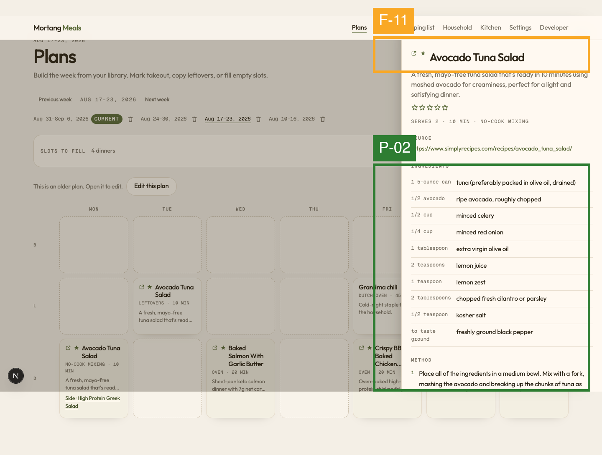

#### [S2] F-11 · No visible way to dismiss the panel
- **Check:** (user control) · **Heuristics:** Nielsen #3, Tog: Explorable interfaces
- **Evidence:** The panel header is the title **Avocado Tuna Salad**. There is no ×, Close, or Done in the visible frame. Overlay click may dismiss it; that is not visible.
- **Impact on goal:** After checking a recipe, the cook needs a cheap return to the grid to place the next slot.
- **Recommendation:** Put a Close control in the panel header, and keep overlay-click as a bonus. · **Effort:** S

#### [✓] P-02 · Full recipe is scannable
- **Evidence:** Source URL, servings, time, method, ingredient rows with quantity then name, numbered method. This is the right density for cooking from the card.

### Step 4: Attached side (`04-desktop-add-side.png`)

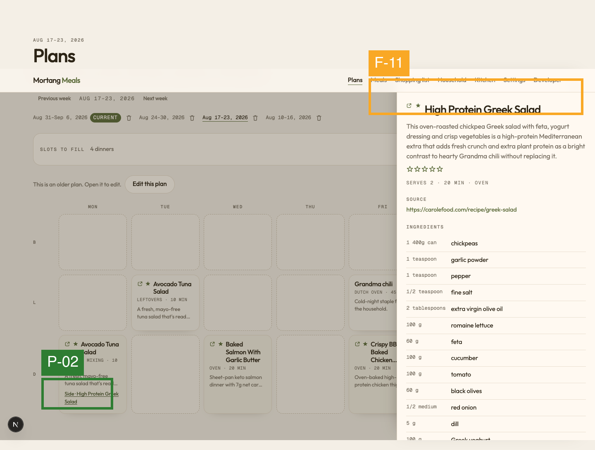

#### [✓] P-02 · Side is a named link on the meal card
- **Evidence:** Monday dinner shows **Side: High Protein Greek Salad** as an underlined link. Add side / Add dessert on current-week cards (step 1) match this. Keep linking extras on the card rather than a second generate flow.

F-11 repeats: the side panel also has no visible close.

### Step 5: Meals library (`05-desktop-meals.png`)

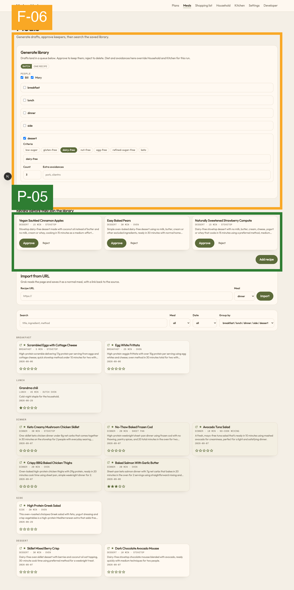

#### [S2] F-06 · One page does five jobs
- **Check:** OVERLOAD · **Heuristics:** Hick's Law, G-P #8, B&S: Workload
- **Evidence:** **Generate library** shows breakfast, lunch, dinner, side, and dessert as stacked rows, even when only dessert is checked. Below that: draft queue, **Add recipe**, **Import from URL**, search/filter, then the full catalog grouped by type. The page is 2883px tall.
- **Impact on goal:** Planning this week from the library does not require generating. When the cook *does* need a new dessert, four empty type rows and import/search compete with **Generate drafts**.
- **Recommendation:** Collapse unchecked types. Default the page to catalog + search; park generate/import behind “Add to library”. Keep the draft queue at the top only when drafts exist. · **Effort:** M

#### [✓] P-05 · Drafts are reviewed before they join the library
- **Heuristics:** Nielsen #5, Shneiderman #4 (closure)
- **Evidence:** **Review before they join the library** with **Approve** (filled) and **Reject** (text) on each dessert draft. The library does not silently absorb model output. Keep this gate.

### Step 6: Shopping list, this week (`06-desktop-shopping.png`)

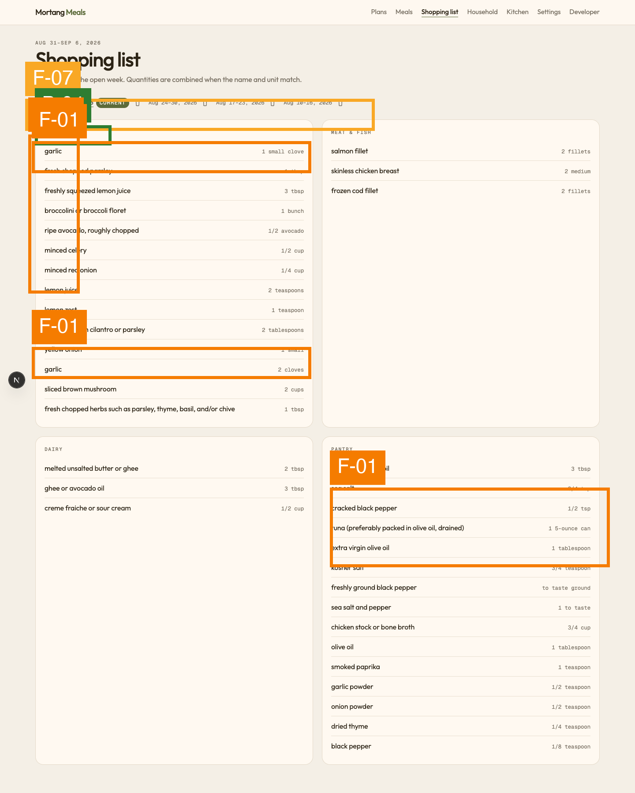

#### [S3] F-01 · The list does not merge the same ingredient
- **Check:** OVERLOAD · **Heuristics:** G-P #7 (don't make the user compute), Nielsen #8, Peak-End Rule
- **Evidence:** Produce lists **garlic · 1 small clove** and later **garlic · 2 cloves**. Pantry lists **extra virgin olive oil · 3 tbsp** and **extra virgin olive oil · 1 tablespoon**. Lemon juice vs freshly squeezed lemon juice; parsley vs chopped fresh herbs; several pepper lines. The subtitle claims “Quantities are combined when the name and unit match.” The screen shows they are not, in practice.
- **Impact on goal:** This is the last screen of the journey. The cook either over-buys or stands in the aisle adding cloves. Peak-End says this is what they remember.
- **Recommendation:** Normalize unit aliases (tbsp / tablespoon, clove / small clove) and obvious name variants before merge. Show one garlic line. Leave a per-recipe breakdown behind a tap if needed. · **Effort:** M

#### [S3] F-02 · Nothing can be checked off
- **Check:** STATE-GAP · **Heuristics:** Jakob's Law, Nielsen #1, Shneiderman #3
- **Evidence:** Every row is static name + quantity. No checkbox, no strike, no “packed” or “at store” control. Aisle headers (P-04) are the only structure.
- **Impact on goal:** A shopping list that cannot record progress is a printout. In the store, the cook loses their place and re-reads the whole produce column.
- **Recommendation:** Add a check control per row (and per aisle). Persist checks for the open week. Optional: hide checked items. · **Effort:** S

F-07 repeats: week chips with trash sit above the list.

#### [✓] P-04 · Aisle grouping
- **Heuristics:** G-P #6, B&S: Grouping
- **Evidence:** PRODUCE, MEAT & FISH, DAIRY, PANTRY. This is how people shop. Keep the grouping; fix the merge inside each group.

### Step 7: Shopping list, filled week (`07-desktop-shopping-filled.png`)

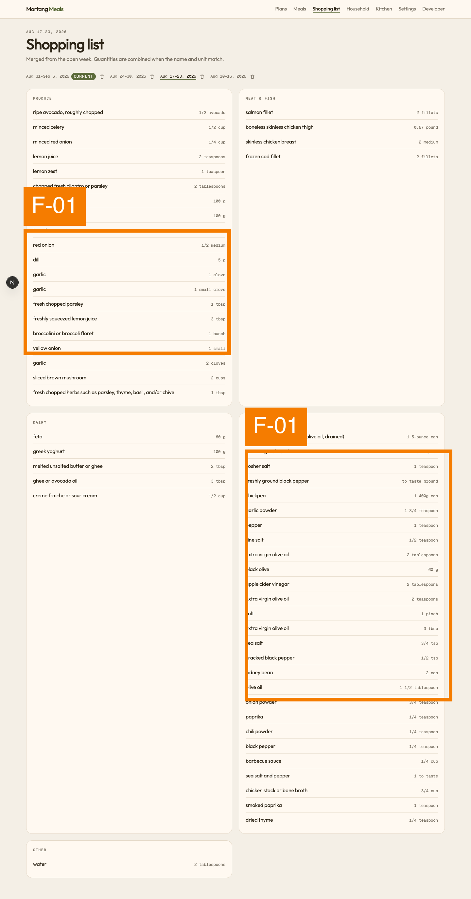

#### [S3] F-01 · Worse on a full week (occurrence)
- **Evidence:** **garlic** appears as 1 clove, 1 small clove, and 2 cloves. Pantry repeats **extra virgin olive oil** at 1 tablespoon, 2 tablespoons, 2 teaspoons, and 3 tbsp. **0.67 pound** of chicken thigh is a machine quantity. The ending of a *successful* plan is a noisier list.

### Step 8: Household (`08-desktop-household.png`)

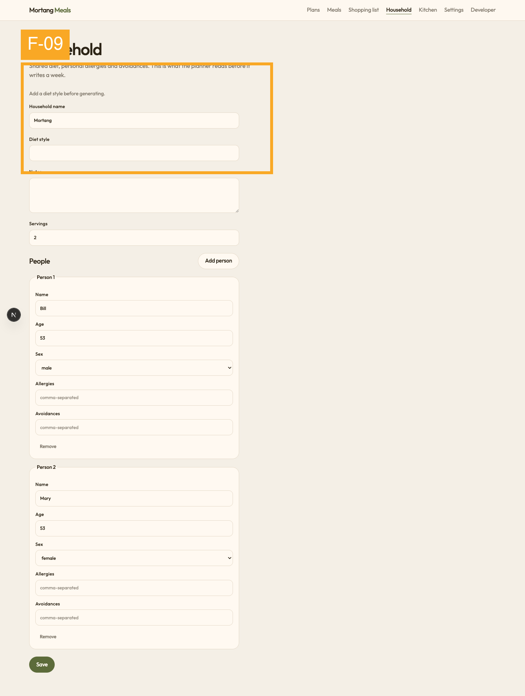

#### [S2] F-09 · Copy still describes generating a week
- **Check:** JARGON-LEAK · **Heuristics:** Content #5 (one term per concept), Nielsen #2
- **Evidence:** “This is what the planner reads before it **writes a week**.” “Add a diet style **before generating**.” **Diet style** is empty. Kitchen (step 9) already has **high-protein**.
- **Impact on goal:** Plans is a library fill. Warning the cook to set a diet “before generating” points at a flow that is no longer on this screen, and hides that Kitchen already has a diet.
- **Recommendation:** Describe Household as who you cook for (allergies, servings, people). Point diet at Kitchen, or show the resolved diet here. Drop “generating” / “writes a week”. · **Effort:** S

### Step 9: Kitchen (`09-desktop-kitchen.png`)

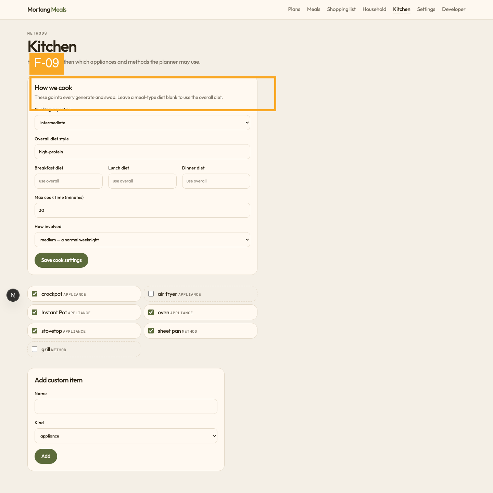

#### [S2] F-09 · “Every generate and swap” (occurrence)
- **Evidence:** “These go into every **generate and swap**.” Appliance checklist and cook-time cap are otherwise clear. The word generate is the old week-AI model; Meals generate-library and Plans fill are the current ones.

### Step 10: Plans, phone (`10-mobile-plans.png`)

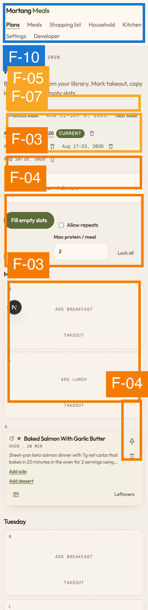

#### [S3] F-04 · Fill options wrap into the wrong groups
- **Check:** TOUCH-TARGET · **Heuristics:** Gestalt: Proximity, Fitts's Law, WCAG 2.5.5 (target size; verify in CSS), B&S: Guidance
- **Evidence:** Nav wraps to two rows, **Developer** on the second. **Fill empty slots** sits beside Allow repeats. **Max protein / meal** sits above a `2` field that is sandwiched between **Leftover lunches** and **Lock all**, so 2 reads as a leftover count. Pin and trash on Monday dinner are icon-only on the card edge (bitmap ~40px at 2x ≈ 20 CSS px, under the 24px floor; verify with a checker). Add side / Add dessert are small text links.
- **Impact on goal:** The phone is where a returning cook will actually fill the week. Mis-set protein or leftover lunches, or miss pin/trash, and the grid is wrong before they ever shop.
- **Recommendation:** Stack fill options one per row, label the `2` as “max times per protein”. 44×44 pt minimum for pin, trash, and week delete. Move Developer out of the wrap. · **Effort:** M

F-03, F-05, F-07, F-10 repeat on this screen.

### Step 11: Meals, phone (`11-mobile-meals.png`)

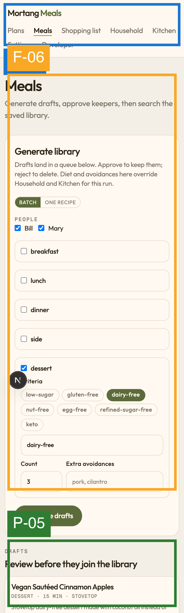

#### [S2] F-06 · Generate form is the first screen (occurrence)
- **Evidence:** Almost the entire first viewport is the generate form (empty breakfast/lunch/dinner/side rows, dessert criteria). Drafts begin below the fold. Catalog is far below that. A cook opening Meals to pick a side never sees the library without scrolling past a form.

P-05 still holds: the draft heading and Approve path are visible once you scroll.

### Step 12: Shopping list, phone (`12-mobile-shopping.png`)

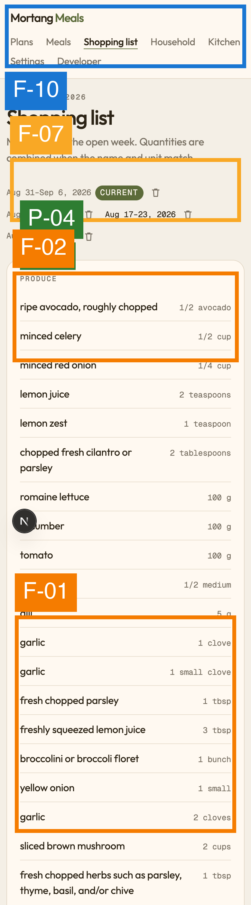

#### [S3] F-01 / F-02 · Same list failures, thumb-width (occurrence)
- **Evidence:** Produce shows **garlic · 1 clove**, **garlic · 1 small clove**, and **garlic · 2 cloves** as three rows. No check control. Week chips with trash wrap onto two lines. The subtitle still promises merge.

This is the Peak-End screen on mobile.

## Journey-Level Findings

- **The grid and the list disagree about effort.** Plans looks busy (F-03) even when dinners are done. Shopping looks simple and then fails the merge it advertises (F-01). Nielsen #1 and G-P #2: status is visible on Plans (“CURRENT”, older-plan lock) and dishonest on the list.
- **Week chrome is copy-pasted, not designed (F-05, F-07).** Heading date + prev/next + chip row + trash appear on Plans and on Shopping list. WCAG 3.2.4 wants consistent components; consistency of a *bad* pattern is still a tax. One switcher, no delete-on-navigate.
- **Peak-End Rule:** the emotional low and the ending are the shopping list: duplicate garlic, no check-off, tiny trash next to the week you meant to open. Fixing F-01 and F-02 is what the cook walks away feeling.
- **Fogg B=MAP on “fill this week and shop”:**
  - **Prompt:** Fill empty slots is visible and well styled; Shopping list is in the nav. Prompts are not the leak.
  - **Ability:** taxed by empty-cell noise (F-03), phone layout (F-04), and mental merge in the aisle (F-01). Ability is the leak.
  - **Motivation:** recipe cards, leftover badges, and aisle groups help. An empty-looking this week next to a rich last week can still feel like starting over.
- **Miller / recall:** nothing important must be remembered across steps except “which week is open,” and that is exactly what F-05 makes expensive.
- **Cialdini:** no dark patterns. Trust is not the issue; competence of the list is.
- **Language drift (F-09, Content #5):** Plans = library fill. Meals = generate drafts. Household/Kitchen = “generate a week”. One product, two mental models.

## What Works (keep)

- **[P-01] Planner mapping:** days as columns, B/L/D as rows. Matches a paper week. Norman mapping, Gestalt common region.
- **[P-02] Cards and flyout carry cook data:** time, method, leftover badge, source URL, quantity-then-name ingredients, Add side / Add dessert on the card. G-P #9, Nielsen #6.
- **[P-03] Historical plans are read-only with an explicit edit path.** Nielsen #1 and #5. Do not silently mutate last week.
- **[P-04] Aisle-grouped shopping list.** G-P #6. The grouping is right; the rows inside it are not.
- **[P-05] Draft Approve / Reject before the library.** Nielsen #5, Shneiderman #4. Model output does not land as fact.

## Prioritised Recommendations

1. **Quick wins (sev 3, effort S):** check-off on the shopping list (F-02); disable or explain Fill when the mask is already satisfied; stack phone fill fields and label the protein `2` (part of F-04); 44pt pin/trash.
2. **Planned (sev 3, effort M):** ingredient merge that treats tbsp/tablespoon and clove/small clove as the same line (F-01); empty-cell hierarchy so unselected meal rows do not dominate (F-03).
3. **Polish (sev 1–2):** one week switcher (F-05); trash off the chips (F-07); two-line card titles (F-08); Close on the flyout (F-11); generate/import behind a disclosure on Meals (F-06); Household/Kitchen copy matches fill-from-library (F-09); Developer out of the cook nav (F-10).

## Framework Coverage

| Framework | Findings |
|-----------|----------|
| Nielsen | F-01, F-02, F-03, F-05, F-07, F-08, F-09, F-10, F-11, P-02, P-03, P-05 |
| Shneiderman | F-02 (#3 feedback), P-05 (#4 closure) |
| Gerhardt-Powals | F-01 (#7), F-05 (#8), F-06 (#8), P-02 (#9), P-04 (#6) |
| Bastien & Scapin | F-04 Guidance, F-06 Workload, P-04 Grouping |
| Hick / Fitts / Miller / Jakob / Peak-End | F-03, F-06 / F-04, F-07 / week identity (F-05) / F-02 / journey ends on F-01+F-02 |
| Fogg B=MAP | Ability leak at fill (F-03, F-04) and shop (F-01, F-02) |
| Cialdini | No issues found (no dark patterns) |
| Gestalt | F-04 Proximity (protein `2` vs leftover lunches), P-01 |
| Norman | F-05 Mapping, P-01 Mapping |
| Tognazzini | F-11 Explorable |
| WCAG 2.1 (static subset) | F-04 2.5.5 (verify), 3.2.3/3.2.4 week chrome |
| Content heuristics | F-08 #1, F-09 #5, F-10 #9 |

## Sources

Nielsen: nngroup.com/articles/ten-usability-heuristics · Shneiderman: cs.umd.edu/users/ben/goldenrules.html · Gerhardt-Powals: Int. J. HCI (1996) · Bastien & Scapin: INRIA RT-0156 (1993) · Laws: lawsofux.com · Fogg: behaviormodel.org · Cialdini: influenceatwork.com · Norman: jnd.org · Tognazzini: asktog.com/atc/principles-of-interaction-design · WCAG: w3.org/WAI/WCAG21/quickref · Content design: contentdesign.london
